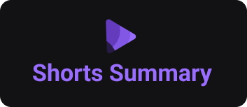

    
    <h2></h2>
    A web application to create a summary of YouTube shorts using AI.

 

## About

Shorts Summary is a web application to create a summary of short YouTube videos using Artificial Intelligence to transcribe the video content and summarize the content. This project is developed in the Foundations track of the NLW IA edition.

### Features

- Identify, validate and download Youtube Shorts URL
- Convert and extract audio: `.mp4` to `wav`
- Transcribe and summarize with IA

## Getting Started

### Prerequisites

- The NodeJS is required to be able to run this project.

### Usage

1. Clone repository
2. Install NPM Packages `npm i`
3. Run backend `npm run server`
4. Run frontend `npm run web`
5. Open frontend localhost `default: http://localhost:5173/`
6. Insert YTShort URL in portugues `ex: https://www.youtube.com/shorts/_qF7vGPVNso`

### Dependencies

 

## License

This project is protected by the MIT license. See the file [LICENSE](/LICENSE) for more details.

---

